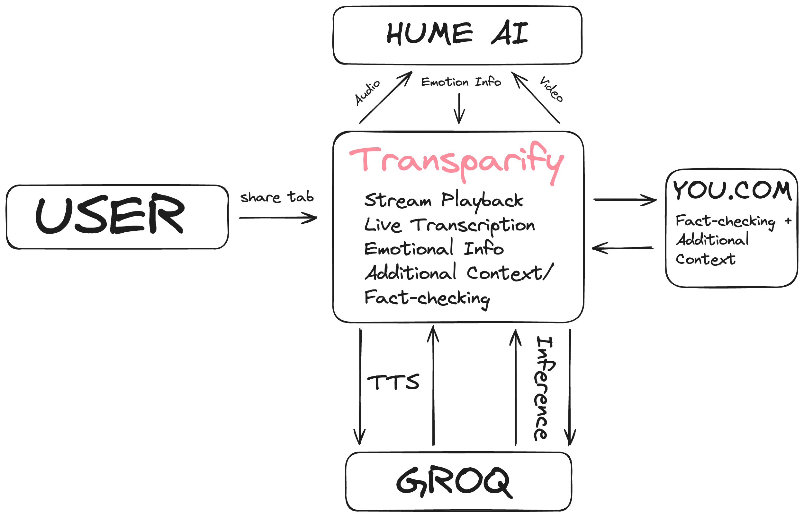

# Transparify

Transparify provides real-time livestream fact-checking and emotional analysis for a more informed and transparent viewing experience.

Built in ~24 hours @ [Cal Hack's AI Hackathon](https://live.calhacks.io). Won $10k "Best Use of You.com's APIs" Grand Prize and an honorable mention from [Groq](https://groq.com).

[/demo video]

## Tech Stack

- **Framework**: Next.js
- **APIs**: Groq, Hume, You.com
- **Styling**: Tailwind CSS

## How it works



## Running Locally

### Cloning the repository to local machine.

```console
git clone https://github.com/minor/transparify.git
cd transparify
```

### Getting API Keys.

The following environment variables are used in this project:

- `NEXT_PUBLIC_GROQ_API_KEY`: API key for accessing Groq services. Get one [here](https://console.groq.com/).
- `NEXT_PUBLIC_HUME_API_KEY`: API key for accessing Hume's services. Get one [here](https://dev.hume.ai/docs/introduction/api-key).
- `YOU_DOT_COM_API_KEY`: API key for accessing You.com services. Get one [here](https://api.you.com/).

Rename `.env.example` and populate the values. Warning: Remember to check the [docs](https://nextjs.org/docs/pages/building-your-application/configuring/environment-variables) about public environment variables before you deploy to production.

### Installing dependencies.

```console
bun install
```

## Running the application.

Then, run the application in the terminal and it will be available at [http://localhost:3000](http://localhost:3000).

```console
bun run dev
```

## Additional Notes

- We were trying to target the following problem: Misinformation and disinformation through livestreams is incredibly rampant.
- We think this idea is just a **proof-of-concept**. The integration may not be the best, but we believe there is definitely a future in which this service is commonly used and extremely impactful.
  - Imagine opening up your TV and there is real-time information on the side of news broadcasts, where there is important information being added that could change the trajectory of your life.
  - It’s very important to keep the general public informed and stop the spread of misinformation/disinformation, and we think that Transparify is the first novel project at envisioning how LLMs can curb this in the future.
